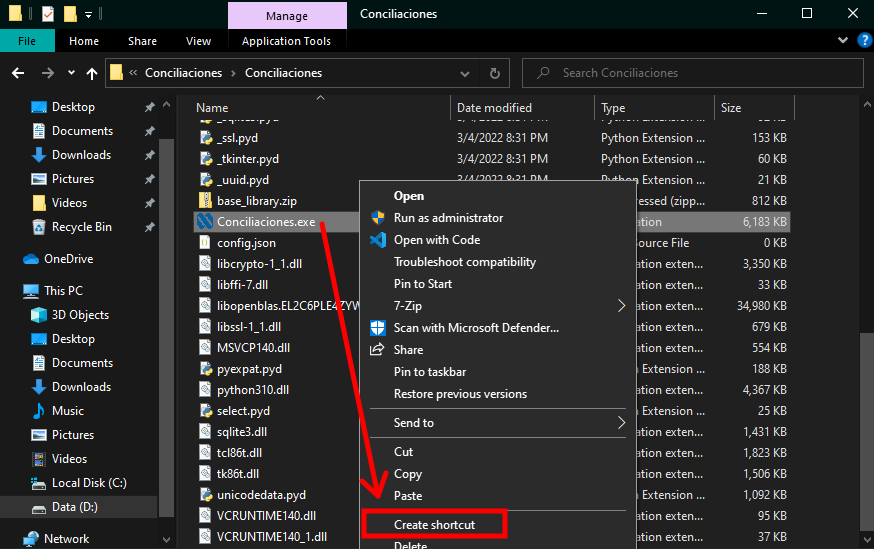

# Sistema generador de conciliaciones bancarias Nipro

## Editar código

### Clonar proyecto

```Powershell
git clone https://github.com/albertolaguna/Conciliaciones.git
cd Conciliaciones
```

### Crear entorno virtual e instalar dependencias

```Powershell
py -m venv venv
.\venv\Scripts\activate
pip install requirements.txt
```

En caso de que no se pueda ejecutar el comando de activación del entorno virtual, es necesario ejecutar el siguiente comando:

```Powershell
Set-ExecutionPolicy -Scope CurrentUser -ExecutionPolicy Unrestricted
```

## Generación de ejecutable

Para generar el ejecutable es necesario tener instalados los requerimientos (es estos se incluye **pyinstaller**) y ejecutar los siguientes comandos dentro del entorno virtual:

```Powershell
pyinstaller.exe --noconsole --windowed --icon=img\logo.ico --name=Conciliaciones  main.py/
mv .\dist\Conciliaciones\ .
rm -r .\__pycache__\, .\build\, .\dist\, .\Conciliaciones.spec
cp .\img\, .\templates\ .\Conciliaciones\
```

## Instalación

Para instalar el sistema en equipos de usuario final, realiza los siguientes pasos:

* Descargar la última versión del sistema [aquí](https://github.com/albertolaguna/Conciliaciones/releases)
* Descomprimir el archivo **Conciliaciones.zip** en la siguiente ruta: `C:\Program Files\`
* El archivo ejecutable será el siguiente: `C:\Program Files\Conciliaciones\Conciliaciones.exe`
* **Opcional:** Para no acceder a la ruta anterior cada que se desea ejecutar el sistema, puedes crear un acceso directo del sistema y moverlo a la siguiente ruta: `C:\Users\%userprofile%\AppData\Roaming\Microsoft\Windows\Start Menu\Programs`. Después de ello, podrás acceder al sistema através de tu menú de inicio.


